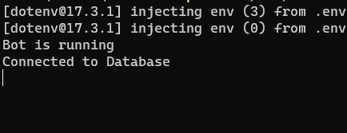

# Indus Telegram Bot Integration

[Indus](https://indus.sarvam.ai/) is a Conversational AI Agent by Sarvam AI. This is an example integration of the Conversational API into a Telegram Bot.

A MongoDB / Database Setup is recommended to store the conversations between the user and the assistant.

The Conversational API currently has no usage limits(As of 25-02-2026)

## Setup your own Bot
* You need to have [Node.js](https://nodejs.org/en) Installed on your Device

### 1. Clone this repository
```
git clone https://github.com/sarvamai/sarvam-ai-cookbook/
mkdir sarvam-ai-cookbook
```

### 2. Add a .env to your folder

- Bot Token - Obtain a valid Bot Token from [@BotFather](https://t.me/botfather) on Telegram
- Database URL - Use a MongoDB Atlas Cluster or a Local MongoDB Instance
- Sarvam API Token - Obtain a token from [Sarvam AI Dashboard](https://dashboard.sarvam.ai/)

#### It should look something like this

```
BOT_TOKEN="8123535701:AAHTV0ZVXoaK6vbmJfpx2lNkgtPl-fPCDew"
DB_URL="mongodb://..."
SARVAM_API_TOKEN="sk_0...."
```

### 3. Install the necessary NPM Packages

```
npm i 
```


### 4. Run your Bot

```
npx tsx ./src/index.ts
```

### If you have done everything properly, you should see something like this


### 5. You should be able to access your bot using Telegram with whatever username you have provided. You can interact with the Bot freely. Use the New Chat Button for a new topic. 

* This Bot also supports Inline Queries, meaning that the bot can be tagged in a private or a group chat and can be interacted with.
* Inline Queries are not stored in the Database
* The New Chat Button is to create an entirely new context for the Conversation API and to avoid mixing old conversation data which could affect the current response.

## Dependencies
- [telegraf](http://npmjs.com/package/telegraf) - Telegram Bot Framework for JavaScript/TypeScript
- [telegramify-markdown](https://www.npmjs.com/package/telegramify-markdown) - Parse Markdown into Telegram Compatible MarkdownV2
- [sarvamaiclient](https://www.npmjs.com/package/sarvamai) - Sarvam AI Client for JavaScript/TypeScript
- [mongoose](https://www.npmjs.com/package/telegramify-markdown) - A package to interact with MongoDB Databases

## Not Another Vibecoded Project