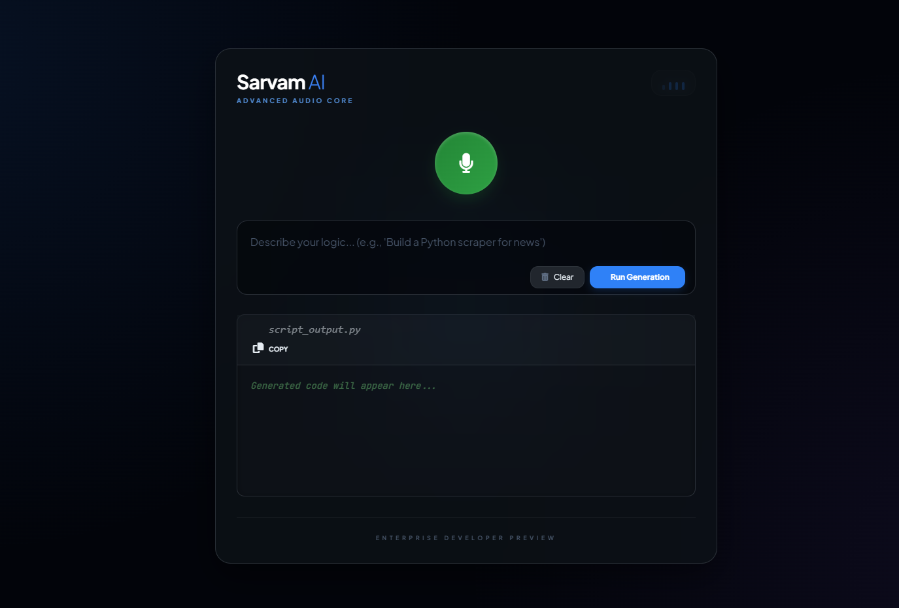
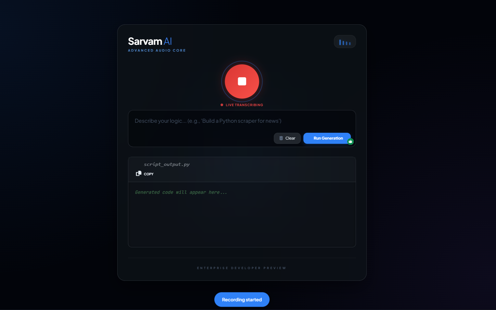
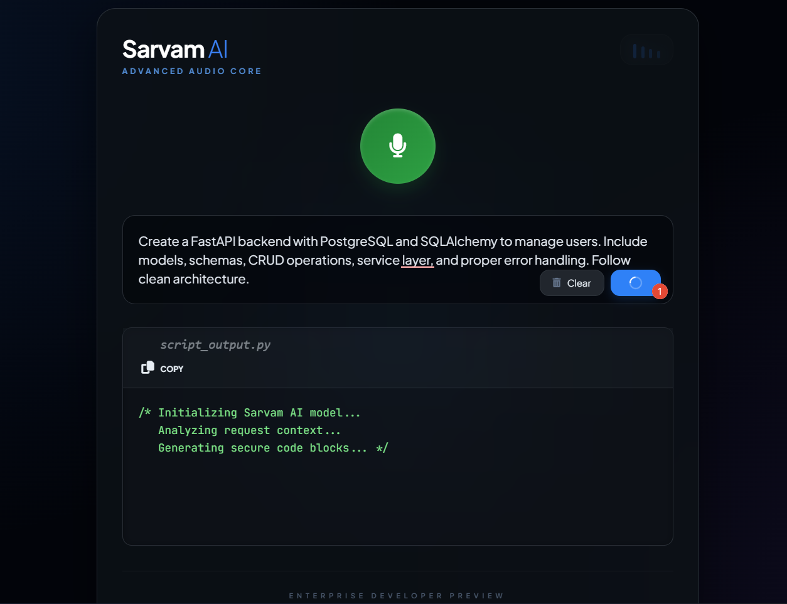
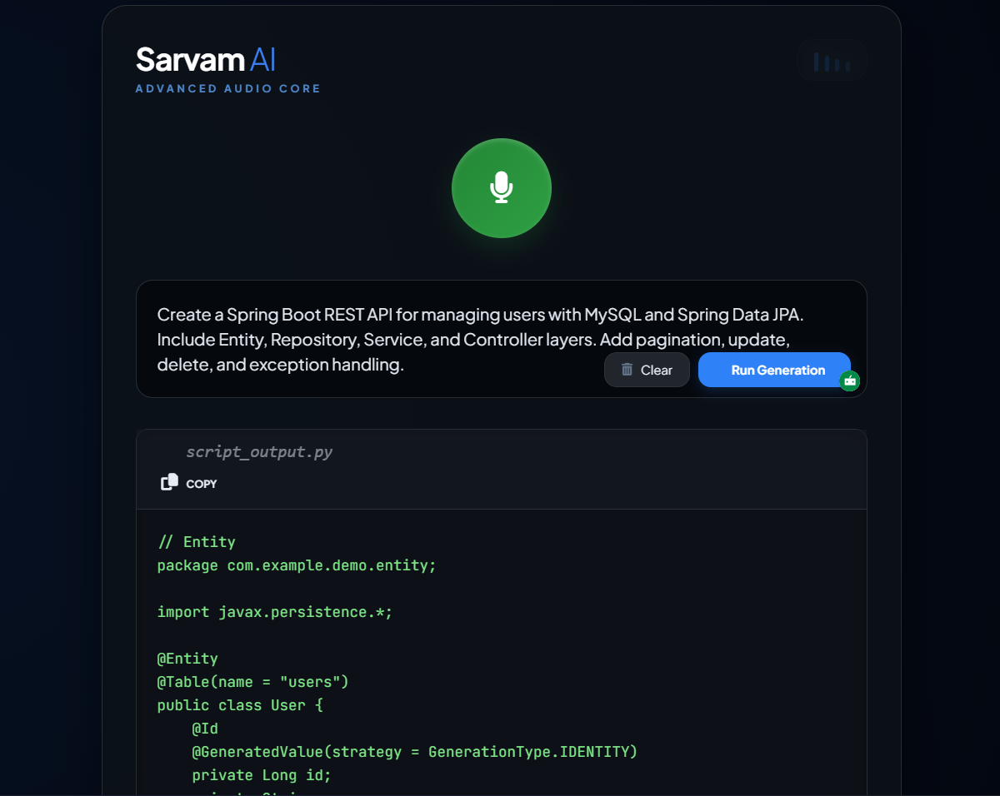

# 🎙️ Sarvam AI Voice Coding Assistant

An AI-powered Voice Coding Assistant built using Flask, Sarvam AI, and Speech Recognition that converts voice or text prompts into clean production-ready code.

Users can speak or type their coding request, and the assistant generates executable code instantly.

---

## 🚀 Features

- 🎤 Voice to text using Speech Recognition
- 🤖 AI-powered code generation using Sarvam AI
- 💻 Supports multiple languages:
  - Java
  - Python
  - JavaScript
  - C++
  - C#
- 🧠 Clean architecture code generation
- 🎨 Modern UI inspired by VS Code
- 📋 Copy generated code easily
- ⚡ Fast and responsive

---

## 🖼️ Screenshots

### Main Interface

### Voice Generation

### Code Recording

### Output View

---

## ⚙️ Installation

### 1. Clone repository

git clone https://github.com/sarvamai/sarvam-ai-cookbook.git

cd examples

cd voice_coding_assistant

---

### 2. Install dependencies

pip install -r requirements.txt

---

### 3. Add Sarvam AI API key

Open app.py

SARVAMAI_API_KEY = "your_api_key_here"

---

### 4. Run application

python app.py

---

### 5. Open in browser

http://127.0.0.1:5000

---

## 🧠 How it works

1. User speaks or types coding request
2. Speech Recognition converts voice to text
3. Flask backend sends prompt to Sarvam AI
4. Sarvam AI generates production-ready code
5. Code is displayed in UI

---

## 🛠️ Tech Stack

Frontend:
- HTML
- TailwindCSS
- JavaScript

Backend:
- Python
- Flask

AI:
- Sarvam AI API

Speech:
- Web Speech API

---

## 🎯 Example Prompts

create spring boot rest api for user management

create fastapi crud application with postgres

create linked list in java

---

## 🔒 Security Note

Never commit your API key publicly.

Use environment variables in production.

---

## 📦 requirements.txt

flask
requests
sarvamai

---

## 🌟 Future Improvements

- Multi-language selector
- Download generated files
- Project generation
- Code execution
- VS Code extension

---

## 👨‍💻 Author

Built using Sarvam AI

---

## ⭐ If you like this project

Give it a star on GitHub ⭐